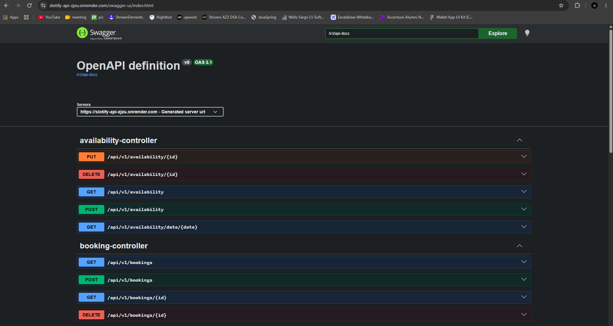
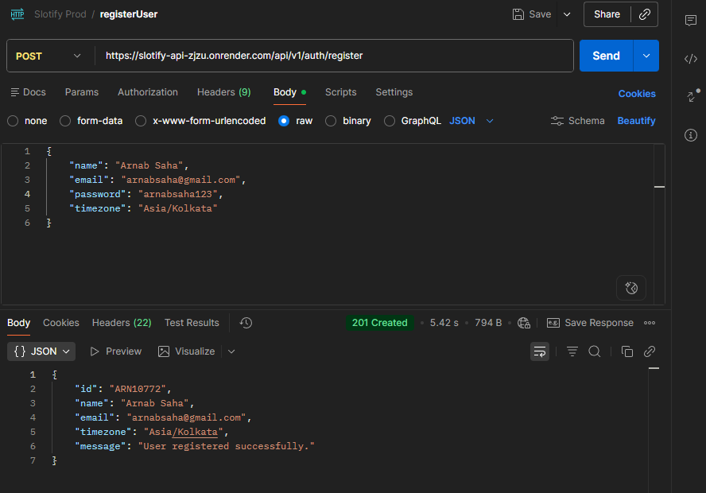
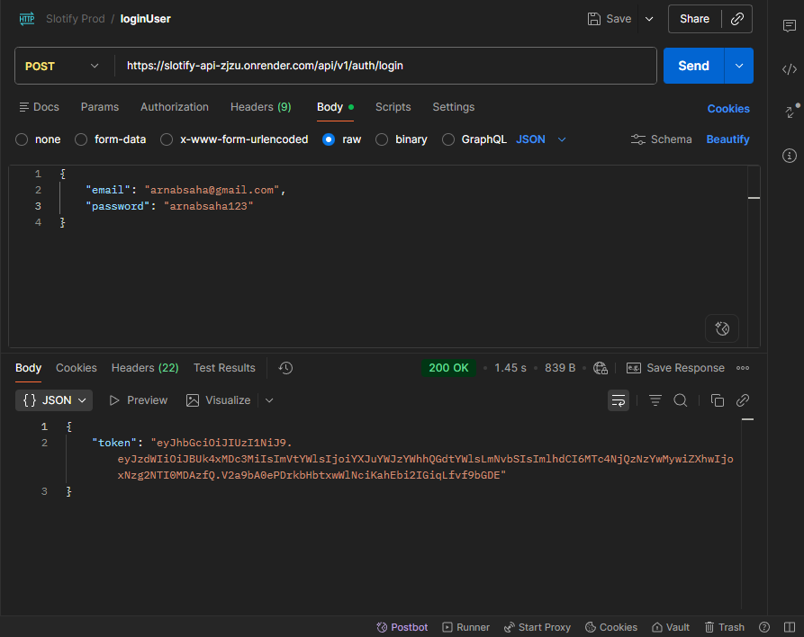
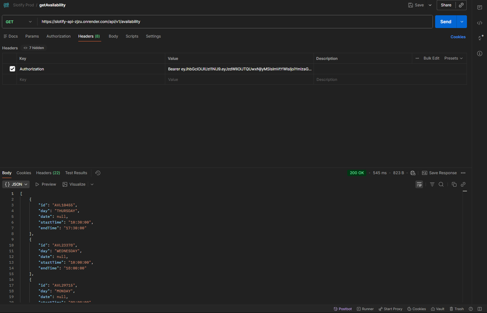
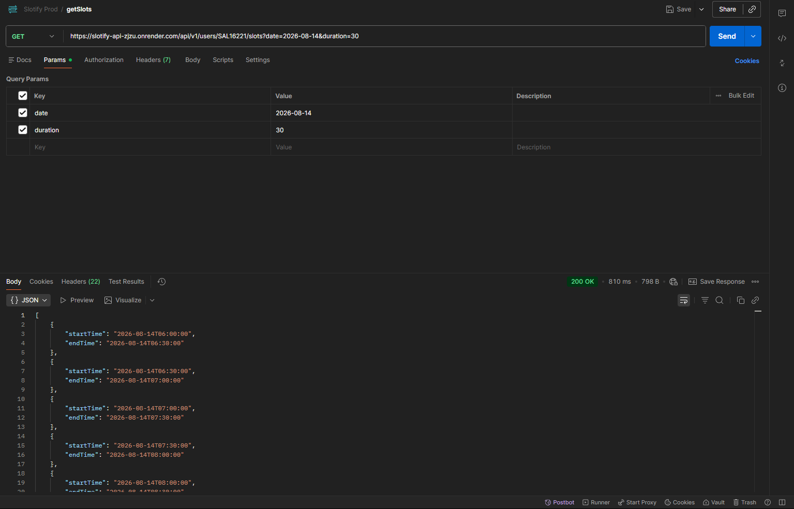
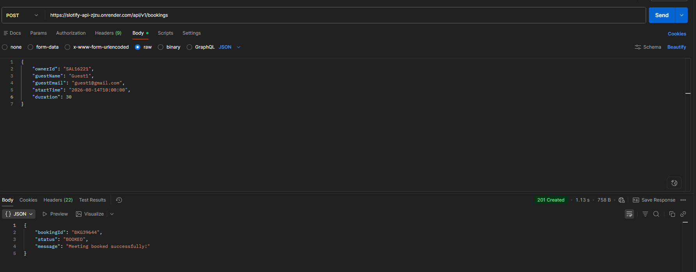
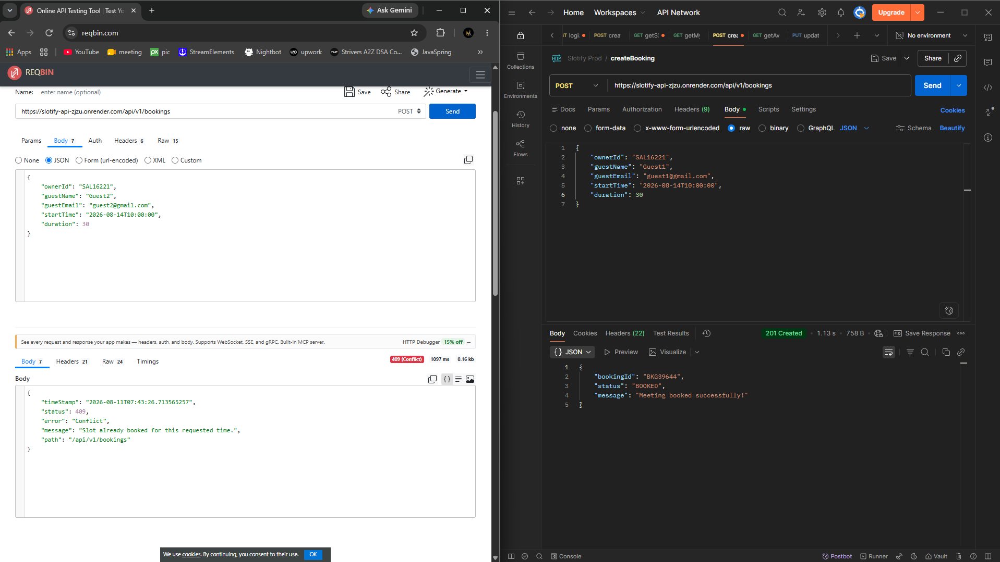

# 🚀 Slotify

> A backend-focused scheduling and appointment booking system inspired by Calendly, built with Java and Spring Boot.

Slotify allows users to manage their weekly availability, generate available time slots, and book or cancel appointments.

The main focus of this project was to go beyond basic CRUD operations and implement real-world backend concepts such as **JWT authentication, scheduling logic, transactions, concurrency control, pessimistic locking, validation, and data consistency**.

---

## 🔒 Concurrency & Double-Booking Prevention

Slotify uses:

- Database transactions
- Pessimistic locking
- Input validation
- Consistent transaction boundaries

to prevent multiple users from successfully booking the same time slot.

For example, if two users attempt to book the same slot at almost the same time:

```text
Request A → 201 Created ✅
Request B → 409 Conflict ❌
```

---

# 🛠️ Tech Stack

| Technology | Purpose |
|---|---|
| Java | Programming Language |
| Spring Boot | Backend Framework |
| Spring Security | Authentication & Authorization |
| JWT | Stateless Authentication |
| Spring Data JPA | Database Access |
| Hibernate | ORM |
| MySQL | Relational Database |
| Docker | Containerization |
| Swagger / OpenAPI | API Documentation |
| Maven | Build & Dependency Management |

---

# 🏗️ Architecture

Slotify follows a layered backend architecture.

```text
                    Client
                      │
                      ▼
                REST Controllers
                      │
                      ▼
                 Service Layer
                      │
                      ▼
               Repository Layer
                      │
                      ▼
                   MySQL DB
```

## 🔐 Authentication Flow

```text
          Client
            │
            ▼
    POST /auth/login
            │
            ▼
   Authentication Service
            │
            ▼
    JWT Token Generated
            │
            ▼
         Client
            │
            ▼
  Authorization: Bearer JWT
            │
            ▼
    Spring Security Filter
            │
            ▼
      Protected API
```

## 📅 Booking Flow

```text
Client
  │
  ▼
Booking Controller
  │
  ▼
Booking Service
  │
  ├── Validate User
  ├── Validate Slot
  ├── Check Availability
  ├── Acquire Database Lock
  ├── Create Booking
  └── Commit Transaction
  │
  ▼
MySQL
```

---

# 🗄️ Database Design

Slotify currently uses **MySQL**.

## Main Entities

```text
                 User
                /    \
               /      \
              ▼        ▼
       Availability   Booking
```

## User

| Field | Description |
|---|---|
| `id` | Primary key |
| `name` | User name |
| `email` | Unique user email |
| `password` | Encrypted password |
| `createdAt` | Account creation time |

## Availability

| Field | Description |
|---|---|
| `id` | Primary key |
| `dayOfWeek` | Day of the week |
| `startTime` | Availability start time |
| `endTime` | Availability end time |
| `user` | Availability owner |

## Booking

| Field | Description |
|---|---|
| `id` | Primary key |
| `startTime` | Appointment start time |
| `endTime` | Appointment end time |
| `status` | Booking status |
| `user` | Booking owner |
| `createdAt` | Booking creation time |

---

# 🔑 Authentication

Slotify uses **Spring Security with JWT** for authentication and authorization.

## Registration

```http
POST /api/v1/auth/register
```

## Login

```http
POST /api/v1/auth/login
```

A successful login returns a JWT token.

Protected APIs require:

```http
Authorization: Bearer <JWT_TOKEN>
```

The JWT is validated by Spring Security before allowing access to protected endpoints.

---

# 📚 API Overview

For complete request and response details, refer to the Swagger documentation.

## Authentication

```http
POST /api/v1/auth/register
POST /api/v1/auth/login
```

## Availability

```http
POST   /api/v1/availability
GET    /api/v1/availability
PUT    /api/v1/availability/{id}
DELETE /api/v1/availability/{id}
```

## Available Slots

```http
GET /api/v1/slots
```

## Bookings

```http
POST   /api/v1/bookings
GET    /api/v1/bookings
DELETE /api/v1/bookings/{id}
```

> **Note:** Refer to Swagger for the latest API contract and complete request/response details.

---

# 🧠 Scheduling Logic

Slotify uses Java's **Date and Time API** to handle scheduling.

The system considers:

- Day of the week
- Start time
- End time
- Appointment duration
- Current date and time
- Existing bookings
- User availability

### Example

Suppose a user has the following availability:

```text
Monday
09:00 - 12:00
```

With an appointment duration of **30 minutes**, the system generates:

```text
09:00 - 09:30
09:30 - 10:00
10:00 - 10:30
10:30 - 11:00
11:00 - 11:30
11:30 - 12:00
```

Already booked slots are excluded from the available slot list.

---

# 🔒 Concurrency Control

A major focus of this project was preventing **double bookings**.

Consider two simultaneous requests attempting to book the same slot:

```text
                Same Slot
                   │
          ┌────────┴────────┐
          │                 │
       Request A         Request B
          │                 │
          └────────┬────────┘
                   ▼
            Database Lock
                   │
                   ▼
           First Transaction
               Succeeds
                   │
                   ▼
            Second Request
               Rejected
```

Slotify uses **pessimistic locking** when accessing booking-related data to ensure that concurrent transactions cannot incorrectly create duplicate bookings.

This provides stronger data consistency during concurrent booking operations.

---

# ⚠️ Validation & Exception Handling

The application includes validation for:

- Invalid user input
- Invalid availability times
- Invalid booking times
- Booking unavailable slots
- Booking past time slots
- Unauthorized access
- Resource ownership
- Duplicate or conflicting bookings

Global exception handling is used to provide consistent API error responses.

### Example

```json
{
  "status": 409,
  "message": "Selected slot is already booked"
}
```

---

# 📂 Project Structure

```text
src
└── main
    ├── java
    │   └── ...
    │       ├── config
    │       ├── controller
    │       ├── dto
    │       ├── entity
    │       ├── exception
    │       ├── repository
    │       ├── security
    │       └── service
    │
    └── resources
        └── application.properties

Dockerfile
pom.xml
README.md
```

The project follows separation of concerns:

```text
Controller
    ↓
Service
    ↓
Repository
    ↓
Database
```

---

# 🐳 Docker

Slotify is containerized using **Docker**.

## Build the Application

```bash
mvn clean package
```

## Build Docker Image

```bash
docker build -t slotify .
```

## Run the Container

```bash
docker run -p 8080:8080 slotify
```

The application will then be available at:

```text
http://localhost:8080
```

---

# 💻 Local Setup

## Prerequisites

Make sure you have installed:

- Java 17+
- Maven
- MySQL
- Docker *(optional)*

---

## 1. Clone the Repository

```bash
git clone https://github.com/Arnab-Saha-2506/Slotify.git
cd Slotify
```

---

## 2. Create MySQL Database

Create a database:

```sql
CREATE DATABASE slotify;
```

---

## 3. Configure Environment Variables

Configure the following environment variables:

```text
DB_URL
DB_USERNAME
DB_PASSWORD
JWT_SECRET
```

### Example

```text
DB_URL=jdbc:mysql://localhost:3306/slotify
DB_USERNAME=root
DB_PASSWORD=your_password
JWT_SECRET=your_secret
```

> ⚠️ **Never commit real database credentials or JWT secrets to GitHub.**

---

## 4. Run the Application

### Using Maven

```bash
mvn spring-boot:run
```

### Or Build and Run the JAR

```bash
mvn clean package
```

```bash
java -jar target/*.jar
```

---

# 🧪 Testing

The application has been tested for:

- User registration
- User login
- JWT authentication
- Availability creation
- Availability updates
- Availability deletion
- Slot generation
- Booking creation
- Booking cancellation
- Authorization
- Input validation
- Exception handling
- Double-booking prevention
- Concurrent booking requests

Special attention was given to concurrent booking scenarios to verify that the same slot cannot be successfully booked multiple times.

---

# 🚀 Deployment

Slotify is deployed as a **Dockerized Spring Boot backend**.

```text
GitHub
   │
   ▼
Docker
   │
   ▼
Render
   │
   ▼
Spring Boot API
   │
   ▼
MySQL
```

## 🌐 Production API

https://slotify-api-zjzu.onrender.com

## 📖 Swagger / OpenAPI

https://slotify-api-zjzu.onrender.com/swagger-ui/index.html

## ❤️ Health Check

https://slotify-api-zjzu.onrender.com/health

> ⚠️ **Free-tier hosting notice:** The application may take some time to respond if it has been inactive. If the API does not respond immediately, please wait a little while for the service to start.

---

# 📸 Screenshots

## Swagger API Documentation



---

## User Authentication

### Register



### Login



---

## Availability Management



---

## Available Time Slots



---

## Booking



---

## Double-Booking Prevention

The application prevents concurrent requests from successfully booking the same time slot.



# 🔮 Future Enhancements

Planned improvements include:

- Google Authentication
- Google Calendar integration
- Email notifications
- Additional scheduling options
- Redis caching
- Improved booking management
- More comprehensive automated tests
- Additional API improvements

---

# 🤝 Acknowledgement

A special thanks to **Arnab Bhadra** for his continuous support, guidance, and valuable feedback throughout the development of Slotify.

Really appreciate the help in making this project better! 🙌

---

# 👨‍💻 Author

**Arnab Saha**

GitHub:  
https://github.com/Arnab-Saha-2506

---

⭐ If you find this project interesting, feel free to explore the repository and share your feedback!
